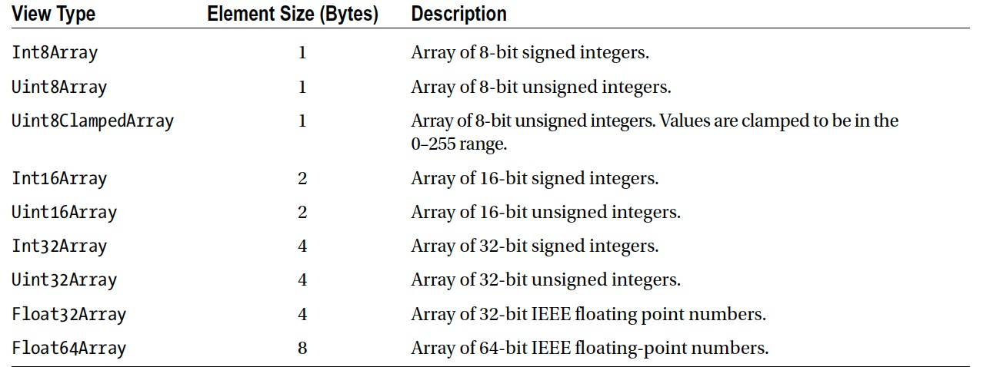
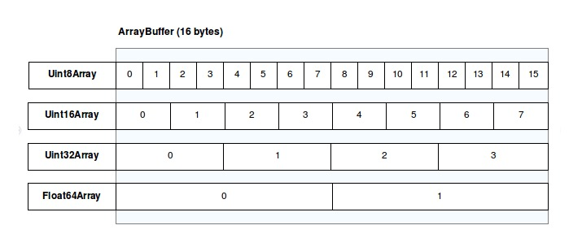
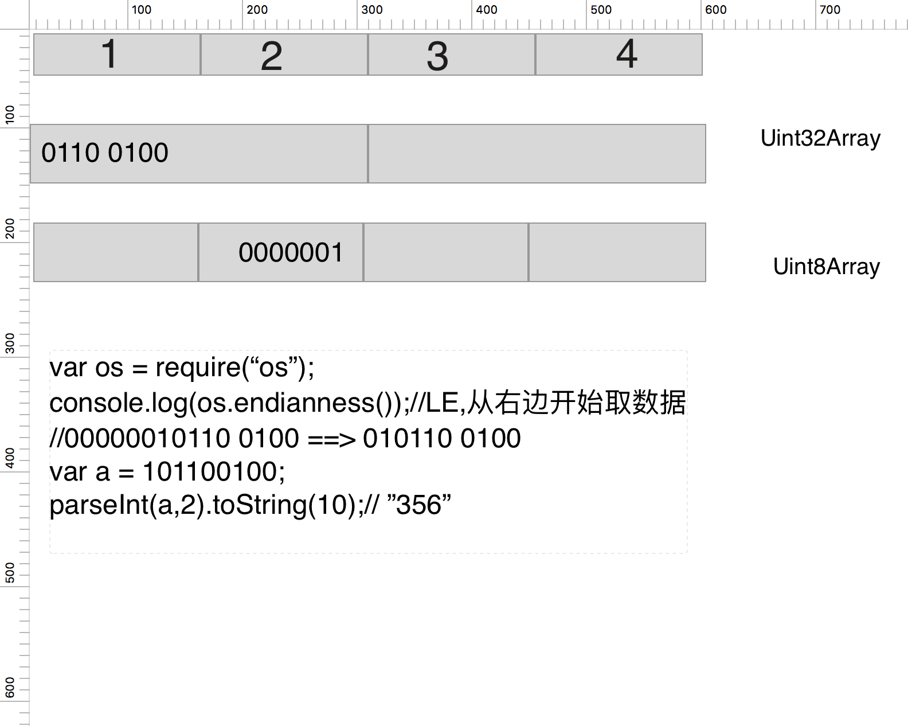

#BinaryData


##Buffer
##Overview
##Typed Array Specification
##Node Buffers

##Endianness


one Byte = 8 places binary

one places hex = 8 places binary 

one places octa = 4 places binary

##ArrayBuffer Views
http://www.javascripture.com/ArrayBuffer

 


#share buffer issue:
```js
var buf = new ArrayBuffer(4);
var view1 = new Uint32Array(buf);
var view2 = new Uint8Array(buf);
view1[0] = 100;
console.log("Uint32 = " + view1[0]);//100
view2[1] = 1;
console.log("Uint32 = " + view1[0]);//356

```




