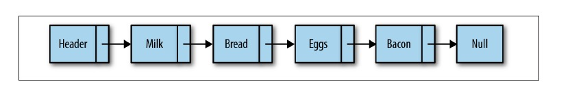
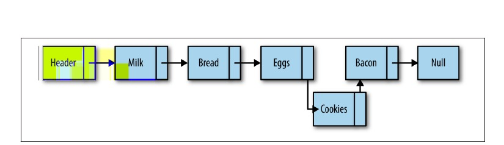
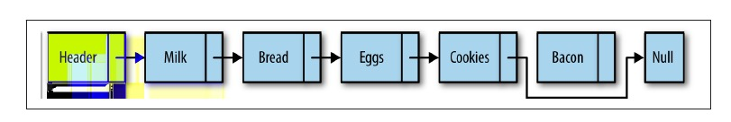
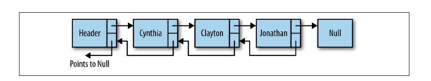
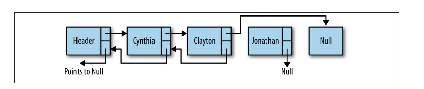
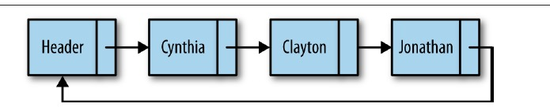

#Linked Lists
##1.linked list

```js

class Node {
    constructor(element) {
        this.element = element;
        this.next = null;
    }
}


class LinkedList {
    constructor() {
        this.head = new Node("head");

    }

    find(item) {
        var currNode = this.head;
        while (currNode.element != item) {
            currNode = currNode.next;
        }
        return currNode;
    }

    insert(newElement, item) {
        var newNode = new Node(newElement);
        var current = this.find(item);
        newNode.next = current.next;
        current.next = newNode;

    }
}
```
##2.add "cookies" item


##remove "bacon" item



##2.Doubly Linked Lists



Removing a node from a doubly linked list




##3.Circularly Linked Lists




