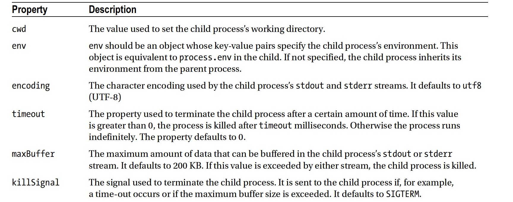
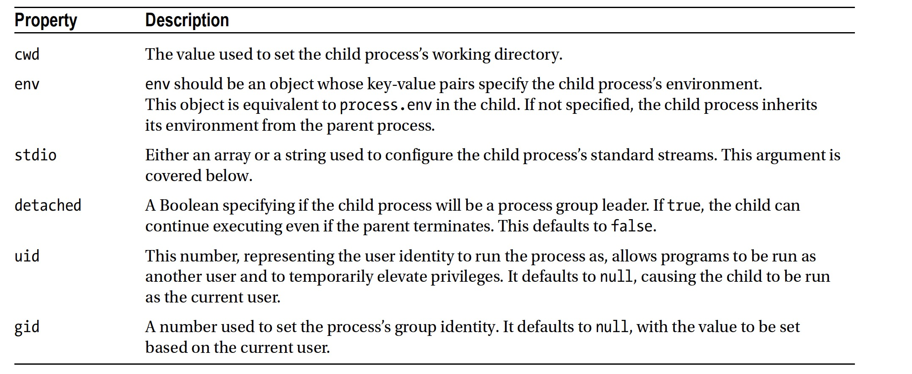
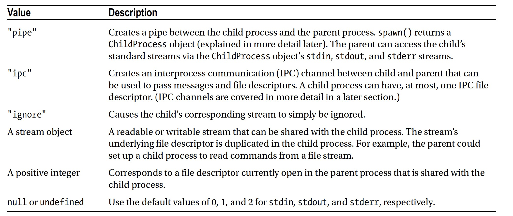
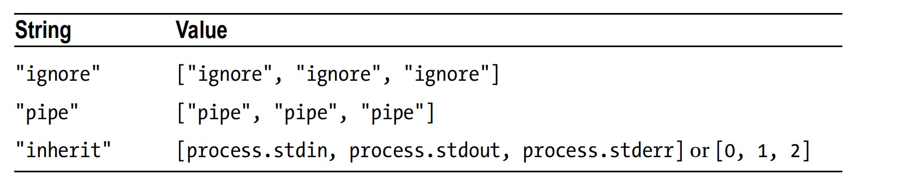

#Executing Code

##The child_process Module
##The vm Module

#####child_process.exec() method options:

#####child_process.spawn() method options:
* Options

* stdio Option

* stdio String Value

